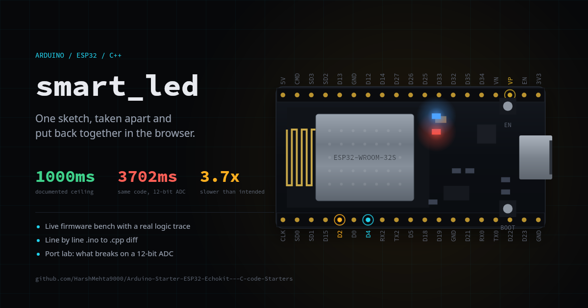
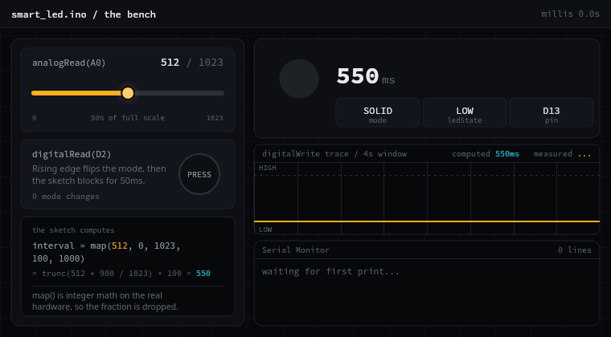
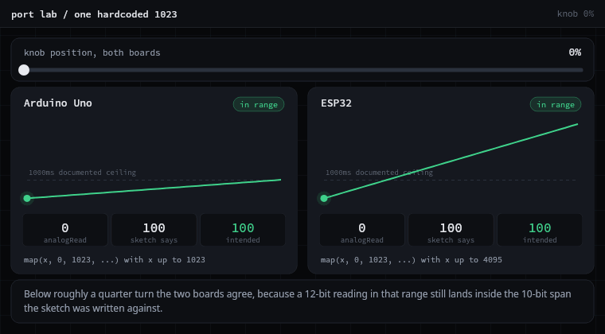
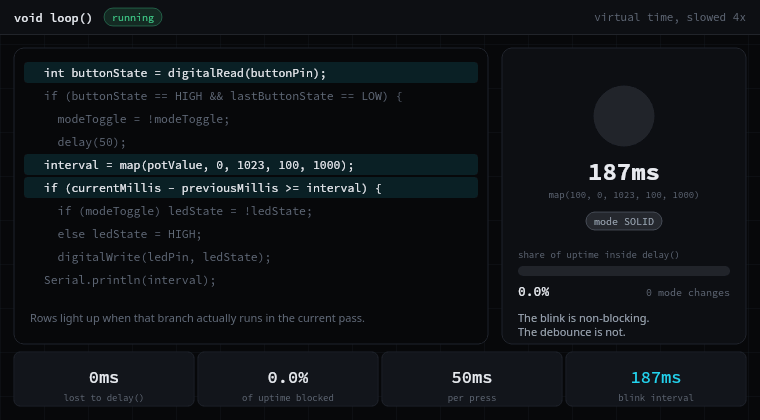
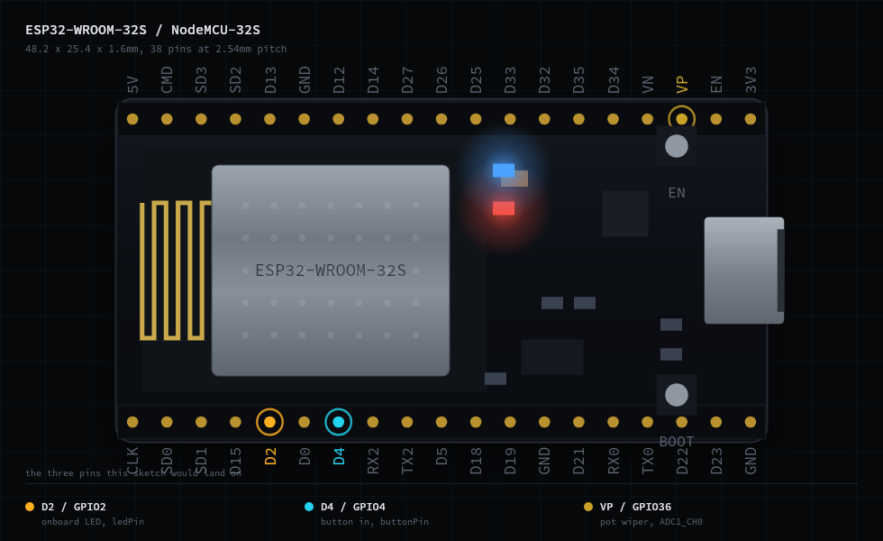

# smart_led

An Arduino sketch that blinks an LED, and an interactive teardown of it.

The sketch is 49 lines. It reads a button, reads a potentiometer, and blinks an
LED without ever calling `delay()` in the blink path. The teardown runs that
firmware in your browser, orbits the board it is named after, diffs the Arduino
dialect against plain C++, and shows the one hardcoded number that stops being
true the moment you move it to an ESP32.



---

## Contents

- [Try it](#try-it)
- [The firmware](#the-firmware)
- [What the teardown shows](#what-the-teardown-shows)
- [The finding](#the-finding)
- [Hardware](#hardware)
- [Running the firmware](#running-the-firmware)
- [Running the site](#running-the-site)
- [Repository layout](#repository-layout)

---

## Try it

The site is in [`web/`](web) and runs offline. Nothing is fetched from a CDN at
runtime, including the fonts and the 3D board's environment lighting.

```bash
cd web
npm install
npm run dev
```

---

## The firmware

Two files, same program, two dialects.

| File | Lines | Dialect |
| --- | --- | --- |
| [`firmware/smart_led.ino`](firmware/smart_led.ino) | 49 | Arduino |
| [`firmware/smart_led.cpp`](firmware/smart_led.cpp) | 46 | C++ with `#include <Arduino.h>` |

What it does:

- The button toggles between **solid** and **blinking**.
- The potentiometer sets the blink interval, documented as 100ms to 1000ms.
- The blink is timed with `millis()`, so it does not block.
- The interval is printed to serial once a second.

The whole program is two inputs and one output. That is what makes it worth
taking apart: there is nowhere for behaviour to hide.

---

## What the teardown shows

Three interactive pieces, plus a 3D board on the hero built to the published
mechanical spec of an ESP32-WROOM-32S NodeMCU-32S.

### 1. The bench



Turn the trimmer, press the button, and watch the sketch respond. The interval
readout is the result of the sketch's own `map()` call with integer truncation
included, because Arduino's `map()` is integer math and rounding it would be a
different program.

The trace underneath is a logic analyser view of the LED pin. It measures its
own period off the recorded edges rather than repeating the computed interval,
which makes it a check on the simulation instead of a restatement of it. Hold
the knob still and the two numbers meet.

### 2. The diff

Every line of `.ino` against every line of `.cpp`, side by side or unified,
with each change annotated as either the Arduino dialect doing its job or the
port losing something. It also walks through what the Arduino build actually
does to a sketch before the compiler sees it: concatenate, insert
`Arduino.h`, generate prototypes, compile as C++.

### 3. The port lab



One knob driving both board profiles through the sketch's unchanged `map()`
call. See [the finding](#the-finding) below.

### And the thing the sketch says it is not



The README of the original project leads with non-blocking timing, and the
blink path honours it. The debounce does not. `delay(50)` in the button branch
halts `loop()` outright: no pot sampling, no toggling, no serial, for a
twentieth of a second per press. The clip is slowed four times over so the
stall is visible at all.

---

## The finding

This repository is named for the ESP32. The sketch targets an Uno.

```cpp
interval = map(potValue, 0, 1023, 100, 1000);
```

`1023` is the full scale of a 10-bit ADC, which is what an Uno has. The ESP32's
ADC is 12-bit and `analogRead()` returns up to 4095. The literal does not know
that, so recompiling the sketch unchanged for the board on the label is not a
no-op:

| Knob | `analogRead()` | Sketch computes | Sketch intends |
| --- | --- | --- | --- |
| Uno, fully open | 1023 | 1000ms | 1000ms |
| ESP32, fully open | 4095 | **3702ms** | 1000ms |

3.7 times slower than documented, at full scale. Nothing throws, nothing looks
broken, the knob still turns and the LED still blinks. The documented range is
simply no longer the range you get, and the failure only shows up past about a
quarter turn, which is what makes it easy to miss on the bench.

The smallest safe fix is to stop hardcoding the width:

```cpp
interval = map(potValue, 0, ADC_FULL_SCALE, 100, 1000);
```

Four more findings are written up on the site, including a floating button
input, the serial logging that the C++ port drops, and a latency quirk in solid
mode. Each one cites a line number resolved by searching the source, so the
citations cannot drift when the code moves.

---

## Hardware



As written, for an Arduino Uno:

| Part | Connection |
| --- | --- |
| LED and 220 ohm resistor | pin 13 |
| Push button | pin 2 |
| Potentiometer, 10k | A0 |

Ported to an ESP32, all three constants change:

| Constant | Uno | ESP32 |
| --- | --- | --- |
| `ledPin` | 13 | GPIO2 |
| `buttonPin` | 2 | GPIO4 |
| `potPin` | A0 | GPIO36, ADC1_CH0 |

Note that `pinMode(buttonPin, INPUT)` leaves the button floating. Either fit a
pull-down resistor or switch to `INPUT_PULLUP` and invert the comparison.

---

## Running the firmware

**Arduino IDE**

1. Open `firmware/smart_led.ino`.
2. Select your board.
3. Upload, then open the serial monitor at 9600 baud.

**PlatformIO**

Use `firmware/smart_led.cpp` with the Arduino framework. Be aware that this
file does not print anything to serial, unlike the `.ino`.

---

## Running the site

```bash
cd web
npm install
npm run dev          # development server
npm run build        # production build
npm run verify:port  # 3080 assertions against the firmware port
npm run media        # regenerate every image in docs/media
```

`npm run verify:port` checks the browser port of the sketch against an
independent reference implementation using truncating BigInt division, across
all 1024 knob positions. It is what keeps the site's arithmetic honest.

`npm run media` regenerates the GIFs and stills above. They are drawn, not
recorded: the build machine has no browser, so a script imports the same
firmware port the site runs, steps `loop()` a millisecond at a time and renders
the frames with node-canvas. Change the sketch, rerun it, and the pictures move
with the code.

---

## Repository layout

```
.
├── firmware/
│   ├── smart_led.ino      Arduino dialect
│   └── smart_led.cpp      the same program in C++
├── docs/media/            generated GIFs and stills
└── web/                   the interactive teardown, Next.js
    ├── scripts/           port verification and media generation
    └── src/
        ├── lib/           firmware port, diff, findings, board spec
        └── components/    the bench, the diff, the port lab, the 3D board
```

---

## Author

Harsh Mehta
